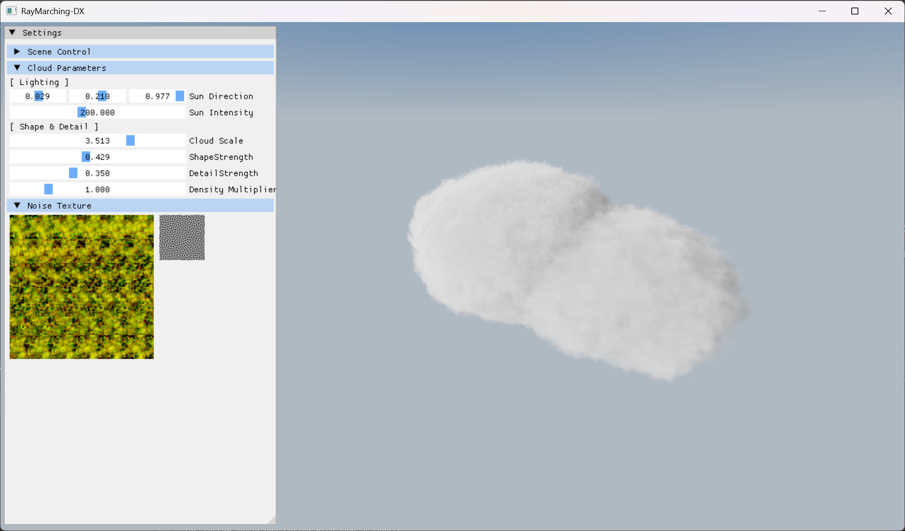

# Volumetric Cloud Study (DX11 Port)

This project analyzes high-quality volumetric cloud rendering techniques from ShaderToy and **ports and optimizes them for the DirectX 11 (C++) environment**.
Through the process of converting GLSL to HLSL, I gained a deep understanding of Raymarching principles and the volumetric rendering pipeline.

## 🎯 Project Goal

* **Porting**: Completely migrate WebGL (GLSL) based shader code to the DirectX 11 (HLSL) environment.
* **Understanding**: Analyze density modeling based on Signed Distance Fields (SDF) and Noise.
* **Engineering**: Design a C++ application-level resource management structure (Texture, Sampler, Buffer), going beyond standalone shader execution.
* **Optimization**: Implement efficient data transfer strategies between CPU and GPU.

## 🛠 Tech Stack

* **Language**: C++ (ISO C++17), HLSL (Shader Model 5.0)
* **API**: DirectX 11
* **Libraries**: DirectXTK (WICTextureLoader), ImGui
* **Environment**: Windows 10/11, Visual Studio 2022

---

## 💡 Key Implementations

### 1. GLSL to HLSL Conversion

Rewrote web-based shader code to fit HLSL syntax and integrated it into the DX11 pipeline.

* **Math Mapping**: Resolved syntax differences and mapped types (e.g., `vec3` → `float3`, `mix` → `lerp`, `fract` → `frac`).
* **Resource Binding**: Converted ShaderToy's channel system into DX11's `Texture2D` and `ShaderResourceView` structures.

### 2. Texture & Sampler Management

Separated logic handled in a single shader according to resource characteristics to ensure quality.

* **Cloud Noise**: Applied `Linear Sampler` for smooth interpolation.
* **Blue Noise (Dithering)**: Created and applied a separate `Point Sampler` to ensure data accuracy and prevent noise pattern blurring.
* **3D Noise Optimization**: Analyzed the structure of 3D Texture Atlas to efficiently sample volumetric noise from a 2D texture.

### 3. C++ System Architecture & Optimization

Built an extensible application structure with a focus on performance.

* **Constant Buffer Splitting**: Separated `GlobalConstants` (Update per frame) and `CloudConstants` (Update on event) to minimize CPU-GPU bus traffic.
* **Dirty Flag Pattern**: Implemented logic to update the Cloud Constant Buffer only when GUI parameters are modified.
* **ResourceManager**: Implemented a texture management system utilizing `std::unordered_map` to prevent duplicate loading.

### 4. Interactive Parameter Analysis (GUI)

Integrated **ImGui** to adjust rendering parameters in real-time for an academic approach.

* **Real-time Tuning**: Dynamically modify physical coefficients (Sun Intensity, Scattering/Absorption, Phase G) without recompiling.
* **Visual Verification**: Observe how numerical changes in the Beer-Lambert law or Phase Function directly impact the visual output.

---

## 📝 Study Notes

Through this project, I verified the following graphics theories via code implementation:

* **Raymarching Loop**: Understanding spatial traversal using `ro + rd * t` and analyzing quality variations based on `Step Size`.
* **Lighting Physics**: Practical application of the `Beer-Lambert Law` (light attenuation) and `Henyey-Greenstein` phase function (light scattering).
* **Optimization**:
* **Loop Unrolling**: Hardcoded static loop counts (`STEPS`) in HLSL to enable compiler optimizations.
* **Branching**: Minimized dynamic branching by using `max()` and mathematical approximations.

---

## 📚 References

This project is a **hybrid implementation** analyzing and combining techniques from multiple high-quality ShaderToy projects.

* **Primary Visual & Technical Reference**
    * **Integrated Cloud Shader** by *swr06*: [VOLUMETRIC CLOUD](https://www.shadertoy.com/view/3sffzj)
    * *Served as the main **visual target** for this project. Adopted its noise texturing strategy and lighting parameters to achieve the final look.*

* **Algorithmic Base**
    * **Clouds** by *swr06*: [A Lonely Cloud ](https://www.shadertoy.com/view/7sSGRV)
    * *Used as the foundational code structure for the raymarching loop and density evaluation logic.*

* **Mathematical Reference**
    * **2D Distance Functions** by *Inigo Quilez*: [2D SDFs](https://iquilezles.org/articles/distfunctions2d/)
    * **3D Distance Functions** by *Inigo Quilez*: [3D SDFs](https://iquilezles.org/articles/distfunctions/)
    * *Standard reference for 2D Signed Distance Field (SDF) implementations, ported to HLSL.*

---